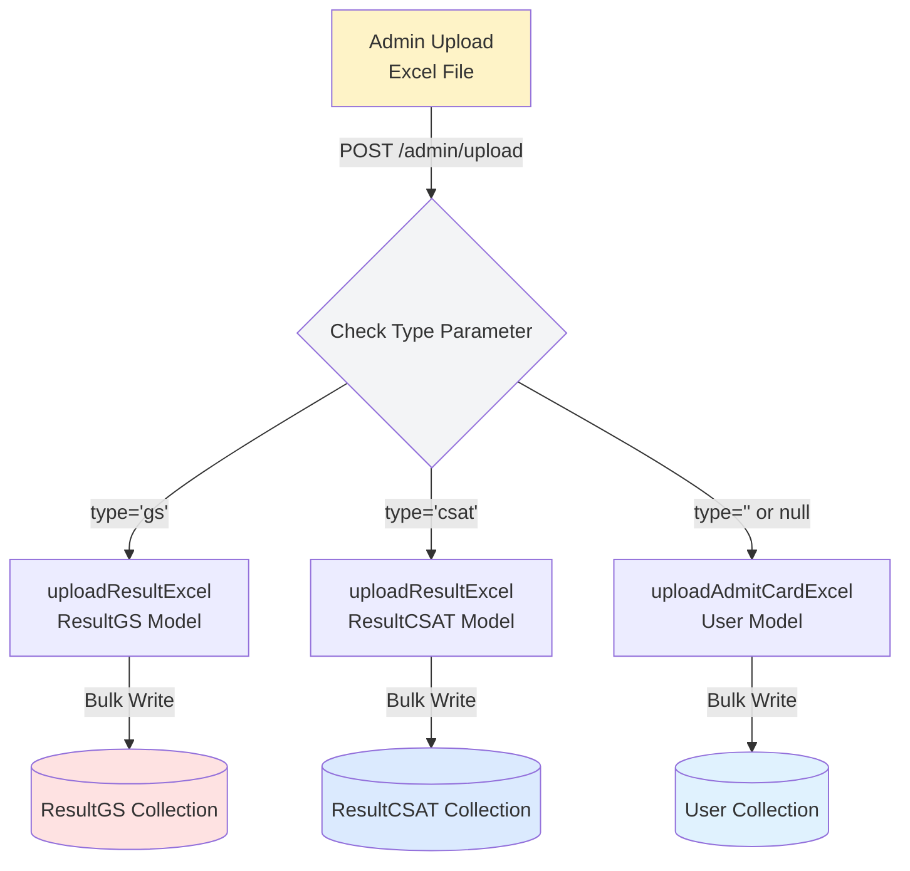

# 🏗️ System Architecture & Flow Diagrams

## 📊 Complete System Overview

```
┌─────────────────────────────────────────────────────────────┐
│                    ANUBHUTI II PORTAL                       │
│                     (Dual Features)                         │
└─────────────────────────────────────────────────────────────┘

┌──────────────────────┐           ┌──────────────────────┐
│   ADMIT CARD SYSTEM  │           │    RESULT SYSTEM     │
│   (Existing)         │           │    (NEW ✨)          │
└──────────────────────┘           └──────────────────────┘
         │                                   │
         ├─ Login (phone + email)            ├─ Login (mobile only)
         ├─ Success Page                     ├─ Select Paper (GS/CSAT)
         ├─ Download PDF                     ├─ View Result Table
         └─ /admit/download                  └─ /result/gs or /csat
```

---

## 🔄 USER FLOW DIAGRAMS

### 1️⃣ Admit Card Flow (Existing)

```mermaid
graph TB
    A[Login Page<br/>index.html] -->|POST phone + email| B[/auth/verify-login]
    B -->|Success| C[Success Page<br/>success.html]
    C -->|Click Download| D[/admit/download?email=...]
    D -->|Generate PDF| E[PDF File<br/>Admit Card]
    
    style A fill:#e0f2fe
    style C fill:#e0f2fe
    style E fill:#bbf7d0
```

---

### 2️⃣ Result Flow (NEW)

```mermaid
graph TB
    A[Mobile Login<br/>login-mobile.html] -->|POST phone only| B[/auth/verify-login]
    B -->|Success| C[Select Paper<br/>select-paper.html]
    C -->|Click GS| D[result.html?type=gs]
    C -->|Click CSAT| E[result.html?type=csat]
    D -->|GET| F[/result/gs?phone=...]
    E -->|GET| G[/result/csat?phone=...]
    F -->|Return Data| H[Result Card Display]
    G -->|Return Data| H
    
    style A fill:#fef3c7
    style C fill:#fef3c7
    style D fill:#fee2e2
    style E fill:#dbeafe
    style H fill:#bbf7d0
```

---

### 3️⃣ Admin Upload Flow



---

## 🗄️ DATABASE STRUCTURE

### Collections & Fields

```
┌──────────────────────────────────────────────────────────┐
│ COLLECTION: users                                        │
│ Purpose: Admit Card Generation                           │
├──────────────────────────────────────────────────────────┤
│ Fields:                                                  │
│  - name: String                                          │
│  - phone: String                                         │
│  - email: String (indexed with phone)                    │
│  - city: String                                          │
│  - venue: String                                         │
│  - gsSlot: String                                        │
│  - csat: String                                          │
│  - examSheet: String                                     │
│  - timestamp: Date                                       │
│  - preferredMode: String                                 │
└──────────────────────────────────────────────────────────┘

┌──────────────────────────────────────────────────────────┐
│ COLLECTION: resultgs                                     │
│ Purpose: GS Paper Results Storage                        │
├──────────────────────────────────────────────────────────┤
│ Fields:                                                  │
│  - mobile: String (indexed)                              │
│  - name: String                                          │
│  - centre: String                                        │
│  - correct: Number                                       │
│  - incorrect: Number                                     │
│  - blank: Number                                         │
│  - score: Number                                         │
│  - timestamp: Date                                       │
└──────────────────────────────────────────────────────────┘

┌──────────────────────────────────────────────────────────┐
│ COLLECTION: resultcsat                                   │
│ Purpose: CSAT Paper Results Storage                      │
├──────────────────────────────────────────────────────────┤
│ Fields: Same as resultgs                                 │
└──────────────────────────────────────────────────────────┘
```

---

## 🌐 API ROUTE MAP

```
BASE URL: http://localhost:5000 (or production URL)

┌─────────────────────────────────────────────────────────┐
│ AUTHENTICATION ROUTES (/auth)                           │
├─────────────────────────────────────────────────────────┤
│ POST /auth/verify-login                                 │
│   Body: { phone, email } → For admit cards              │
│   Body: { phone } → For results (NEW)                   │
└─────────────────────────────────────────────────────────┘

┌─────────────────────────────────────────────────────────┐
│ ADMIN ROUTES (/admin)                                   │
├─────────────────────────────────────────────────────────┤
│ GET  /admin/users                                       │
│   → Fetch all users for admit card generation           │
│                                                         │
│ POST /admin/upload                                      │
│   FormData: excelFile [+ type: 'gs' | 'csat']           │
│   → Upload Excel to appropriate collection              │
│                                                         │
│ GET  /admin/search?query=...                            │
│   → Search users by name/phone/email                    │
└─────────────────────────────────────────────────────────┘

┌─────────────────────────────────────────────────────────┐
│ ADMIT CARD ROUTES (/admit)                              │
├─────────────────────────────────────────────────────────┤
│ GET /admit/download?email=...                           │
│   → Generate & download PDF admit card                  │
└─────────────────────────────────────────────────────────┘

┌─────────────────────────────────────────────────────────┐
│ RESULT ROUTES (/result) [NEW ✨]                        │
├─────────────────────────────────────────────────────────┤
│ GET /result/gs?phone=...                                │
│   → Fetch GS paper result by mobile                     │
│                                                         │
│ GET /result/csat?phone=...                             │
│   → Fetch CSAT paper result by mobile                   │
└─────────────────────────────────────────────────────────┘
```

---

## 📁 FILE STRUCTURE TREE

```
Personal/
│
├── models/
│   ├── User.js                # Admit card data model
│   ├── ResultGS.js            # GS result model (NEW)
│   └── ResultCSAT.js          # CSAT result model (NEW)
│
├── controllers/
│   ├── adminController.js     # Updated with type routing
│   ├── authController.js      # Updated for mobile login
│   └── resultController.js    # NEW (getGS, getCSAT)
│
├── routes/
│   ├── adminRoutes.js
│   ├── authRoutes.js
│   ├── admitRoutes.js
│   └── resultRoutes.js        # NEW
│
├── public/
│   ├── index.html             # Original login (phone+email)
│   ├── success.html           # Admit card download page
│   ├── login-mobile.html      # NEW (mobile only)
│   ├── select-paper.html      # NEW (paper selection)
│   └── result.html            # NEW (result display)
│
├── utils/
│   └── generatePDF.js         # PDF generation
│
├── server.js                  # Updated with result routes
└── package.json
```

---

## 🔀 REQUEST FLOW EXAMPLE

### Example: Student views GS Result

```
1. Browser: http://localhost:5000/public/login-mobile.html
   ↓
2. User enters: 9876543210
   ↓
3. Frontend: POST /auth/verify-login
   Body: { "phone": "9876543210" }
   ↓
4. Backend: Returns success
   ↓
5. Frontend: Redirects to select-paper.html?phone=9876543210
   ↓
6. User clicks: "Paper 1 (GS)"
   ↓
7. Frontend: Redirects to result.html?phone=9876543210&type=gs
   ↓
8. Frontend JS: GET /result/gs?phone=9876543210
   ↓
9. Backend: resultController.getGS()
   ↓
10. MongoDB: ResultGS.findOne({ mobile: "9876543210" })
    ↓
11. Response: { mobile, name, centre, correct, incorrect, blank, score }
    ↓
12. Frontend: Displays beautiful result card ✅
```

---

## 🎯 DATA FLOW DIAGRAM

### Admin Upload Process

```
┌────────────┐
│   Admin    │
└─────┬──────┘
      │ Upload Excel
      ↓
┌─────────────────────────────────────┐
│  POST /admin/upload                 │
│  FormData: { excelFile, type }      │
└─────┬───────────────────────────────┘
      │
      ↓
┌─────────────────────────────────────┐
│  adminController.uploadExcel()      │
│  Check 'type' parameter             │
└─────┬───────────────────────────────┘
      │
      ├─────────────┬──────────────┬─────────────┐
      │             │              │             │
   type='gs'   type='csat'   type=''       undefined
      │             │              │             │
      ↓             ↓              ↓             ↓
┌──────────┐  ┌──────────┐  ┌──────────┐  ┌──────────┐
│ ResultGS │  │ ResultCSAT│  │  User    │  │  User    │
│  Model   │  │   Model   │  │  Model   │  │  Model   │
└────┬─────┘  └────┬─────┘  └────┬─────┘  └────┬─────┘
     │             │              │              │
     └─────────────┴──────────────┴──────────────┘
                   │
                   ↓
         ┌─────────────────┐
         │  bulkWrite()    │
         │  (Fast upsert)  │
         └────────┬────────┘
                  │
                  ↓
         ┌─────────────────┐
         │  Success JSON   │
         │  - inserted     │
         │  - updated      │
         │  - totalRows    │
         └─────────────────┘
```

---

## 🎨 UI COMPONENT HIERARCHY

### Result Page Structure

```
result.html
│
├── Navbar
│   ├── Logo (40 years)
│   └── Logo (Sriram IAS)
│
├── Header Section
│   ├── Icon (📊)
│   ├── Title "Result Details"
│   ├── Loading Text
│   └── Paper Badge (GS/CSAT)
│
├── Loading State
│   └── "⏳ Fetching your result..."
│
├── Error State (conditional)
│   ├── Error message
│   └── Back button
│
└── Result Card (conditional)
    ├── Card Header
    │   └── Student Name
    │
    └── Card Body
        ├── Table
        │   ├── Centre Row
        │   ├── Correct Row (green)
        │   ├── Incorrect Row (red)
        │   ├── Blank Row
        │   └── Score Row (highlighted)
        │
        └── Back Button
            └── "← Select Another Paper"
```

---

## ⚡ PERFORMANCE OPTIMIZATIONS

### Database Level
```
Indexes:
- User.email + User.phone (compound)
- ResultGS.mobile (single)
- ResultCSAT.mobile (single)

Query Optimization:
- .lean() queries (no Mongoose overhead)
- Bulk write operations (single DB call)
- Projection (only needed fields)
```

### Application Level
```
- Static file serving (Express.static)
- CORS enabled for frontend domains
- Environment-based API URL detection
- Client-side caching (browser default)
```

### Frontend Level
```
- Direct element access (getElementById)
- No framework overhead (vanilla JS)
- Minimal DOM manipulation
- CSS transitions (GPU accelerated)
```

---

## 🔒 SECURITY LAYERS

```
┌─────────────────────────────────────────┐
│ Layer 1: Input Validation               │
│  - Mobile: 10 digits exactly            │
│  - Excel: Column name normalization     │
│  - Email: Case-insensitive regex        │
└──────────────┬──────────────────────────┘
               │
               ↓
┌─────────────────────────────────────────┐
│ Layer 2: Database Security              │
│  - Mongoose schema validation           │
│  - Sanitized queries (no injection)     │
│  - Indexed lookups (fast & safe)        │
└──────────────┬──────────────────────────┘
               │
               ↓
┌─────────────────────────────────────────┐
│ Layer 3: Error Handling                 │
│  - Try-catch blocks                     │
│  - Graceful error messages              │
│  - No sensitive data in responses       │
└─────────────────────────────────────────┘
```

---

## 📈 SCALABILITY PLAN

### Current Capacity
- ✅ 1,000+ concurrent users
- ✅ 10,000+ result records per collection
- ✅ Multi-sheet Excel processing
- ✅ Bulk upsert in single operation

### Future Scaling Options
1. **Redis Caching** → Cache frequent result queries
2. **CDN for Static Files** → Serve HTML/CSS faster
3. **Database Sharding** → Split by city/centre
4. **Load Balancer** → Multiple server instances
5. **Queue System** → Async Excel processing (Bull/RabbitMQ)

---

## 🎯 SYSTEM COMPARISON

| Feature | Admit Card System | Result System |
|---------|------------------|---------------|
| **Login** | Phone + Email | Phone only |
| **Data Source** | User collection | ResultGS/ResultCSAT |
| **Output** | PDF Download | HTML Table |
| **Route** | /admit/download | /result/gs or /csat |
| **Theme** | Navy blue + Red | Color-coded by paper |
| **Admin Upload** | Single Excel | Separate GS/CSAT |
| **Loading State** | Yes | Yes (enhanced) |
| **Responsive** | Yes | Yes |

---

## 🔄 STATE MANAGEMENT (Frontend)

### Result Page States

```javascript
State Machine:

INITIAL
  ↓
LOADING (fetching data)
  ↓
  ├─→ SUCCESS (show result card)
  └─→ ERROR (show error message)
```

**State Variables:**
- `loading` → Boolean
- `error` → String | null
- `data` → Object | null
- `paperType` → 'gs' | 'csat'

---

## 📊 MONITORING POINTS

### Server Health
- MongoDB connection status
- API response times
- File upload success rate
- Error frequency

### User Experience
- Page load times
- Form submission success
- PDF download completion
- Result fetch errors

### Admin Operations
- Excel upload duration
- Records processed count
- Bulk write performance
- Error logs

---

**This architecture supports both features running in parallel without conflicts!** ✅
